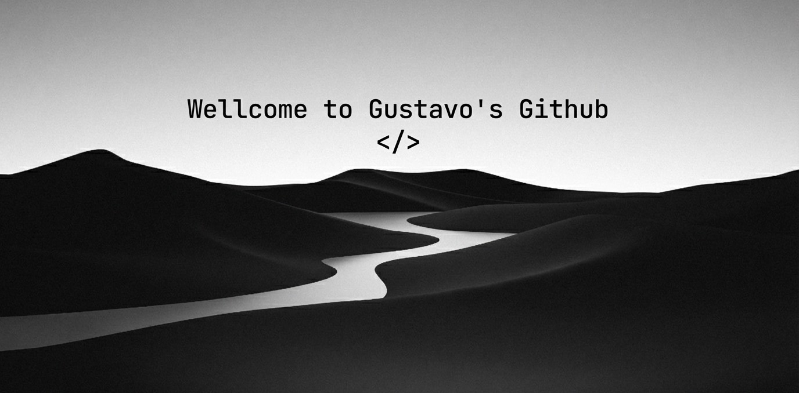

  

  

 

<h2 align="center">  <em> Sobre Mim </em></h2>

 

Olá Pessoal <em><b>Eu sou Gustavo Henrique</b></em>, estudante de Análise de Sistemas.
Gosto de aprender novas tecnologias e de resolver desafios de programação no Codeforces e Codechef.
Atualmente estou trabalhando em alguns projetos pequenos e divertidos para colocar em prática meus conhecimentos em SQL, Python, C# e mais.

 

🎓 <em><b>Estudando na Pontifícia Universidade Católica (PUC)</b></em>  
🤖 <em><b>Apaixonado por IA e Dados</b></em> 
💻 <em><b>Desenvolvendo Projetos...</b></em> 
🏆 <em><b>Competidor em desafios</b></em> 

 

 
 

<h2 align="center">  <em> Tecnologias </em> </h2>

 
 

<h2 align="center">  <em> Estatisticas </em> </h2>

